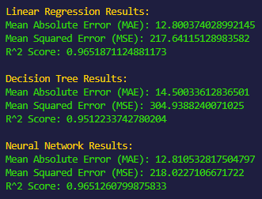
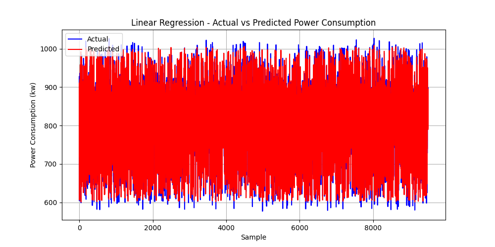
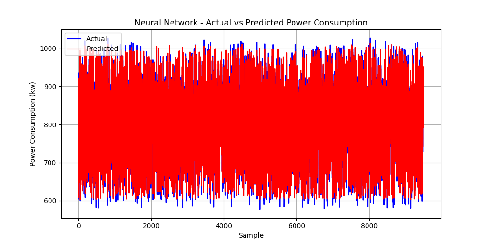

[]()
 
 


> داده‌های این پروژه با استفاده از سنسور **DHT22** از محیط خانه جمع‌آوری شده است. دما و رطوبت به عنوان داده‌های اصلی در این پایگاه داده ثبت شده‌اند. همچنین، برای مدل‌سازی بهتر، مصرف برق به صورت تصادفی و با توجه به شرایط دما و رطوبت با استفاده از یک فرمول محاسبه و به دیتابیس اضافه شده است. این روش به ما امکان پیش‌بینی مصرف انرژی را بر اساس شرایط محیطی فراهم می‌کند.

---
# 📊 Data Preprocessing & Power Consumption Prediction

این پروژه به شما امکان می‌دهد تا داده‌های مربوط به دما، رطوبت و مصرف انرژی را پردازش کرده و پیش‌بینی‌هایی بر اساس آن‌ها انجام دهید. این پروژه شامل مراحل پیش‌پردازش داده‌ها، آموزش مدل‌های مختلف و نمایش نتایج است.

## 🚀 ویژگی‌ها

- **پیش‌پردازش داده‌ها**: این برنامه از دو نوع پردازش داده پشتیبانی می‌کند، یکی با نرمال‌سازی و دیگری بدون آن.
- **مدل‌های پیش‌بینی**: مدل‌های مختلف مانند **رگرسیون خطی**، **درخت تصمیم** و **شبکه عصبی** برای پیش‌بینی مصرف انرژی بر اساس دما و رطوبت استفاده می‌شود.
- **نمودارهای مقایسه‌ای**: بعد از آموزش مدل‌ها، نتایج به همراه نمودارهای مقایسه‌ای بین داده‌های واقعی و پیش‌بینی شده نمایش داده می‌شود.

## 🔧 پیش‌نیازها

برای استفاده از این پروژه، باید مطمئن شوید که پکیج‌های مورد نیاز به درستی نصب شده‌اند. می‌توانید به‌طور خودکار این پکیج‌ها را با استفاده از اسکریپت `auto_lib_downloader` نصب کنید.

### 📥 نصب کتابخانه‌ها

در صورت نیاز به نصب کتابخانه‌ها، فقط کافیست اسکریپت را اجرا کنید تا کتابخانه‌های لازم به‌طور خودکار نصب شوند.

### کتابخانه‌های مورد نیاز:

- `colorama` برای مدیریت رنگ‌ها در ترمینال.
- `pandas` برای پردازش داده‌های جدول.
- `scikit-learn` برای آموزش و ارزیابی مدل‌ها.
- `matplotlib` برای نمایش نمودارها.

## ⚙️ نحوه استفاده

### 1. نصب کتابخانه‌ها:

برای نصب کتابخانه‌های مورد نیاز، کافی است اسکریپت را اجرا کنید:

```bash
python main.py
```

اسکریپت به‌طور خودکار کتابخانه‌های مورد نیاز را دانلود و نصب خواهد کرد.

### 2. پردازش داده‌ها:

بعد از نصب کتابخانه‌ها، از شما خواسته می‌شود که تصمیم بگیرید آیا می‌خواهید داده‌ها را نرمال‌سازی کنید یا خیر. در صورت تمایل به نرمال‌سازی داده‌ها، اسکریپت پیش‌پردازش مناسب اجرا خواهد شد.

### 3. مدل‌های پیش‌بینی:

پس از پردازش داده‌ها، مدل‌های مختلف برای پیش‌بینی مصرف انرژی بر اساس دما و رطوبت آموزش داده می‌شوند. نتایج پیش‌بینی‌ها در قالب نمودار و معیارهای ارزیابی (MAE, MSE, R²) نمایش داده می‌شود.

### 4. نمایش نتایج:

نتایج به صورت جدول و نمودارهای مختلف به شما نشان داده می‌شود تا مقایسه‌ای دقیق بین پیش‌بینی‌ها و داده‌های واقعی داشته باشید.

## 📂 فایل‌ها و دایرکتوری‌ها

- `main.py`: اسکریپت اصلی که شامل کدهای پردازش داده‌ها و آموزش مدل‌ها است.
- `requirements.txt`: فایلی که کتابخانه‌های مورد نیاز پروژه را لیست می‌کند.
- `data/`: دایرکتوری حاوی فایل‌های داده‌ها.
برای تهیه گزارش، باید نتایج پیش‌بینی مصرف انرژی با مدل‌های مختلف و تحلیل عملکرد آن‌ها را بررسی کنیم. برای پاسخ به سؤالات، باید ابتدا به بررسی دقت، خطاهای پیش‌بینی و معیارهای عملکرد هر مدل پرداخته و سپس ویژگی‌های مؤثر را شناسایی کنیم. گزارش نمونه‌ی زیر می‌تواند شما را راهنمایی کند:

---

# گزارش تحلیل نتایج پیش‌بینی مصرف انرژی 📊

هدف این تحلیل، پیش‌بینی مصرف انرژی بر اساس ویژگی‌های دما و رطوبت محیطی است. در این پروژه، از چندین مدل یادگیری ماشین برای بررسی دقت پیش‌بینی استفاده شده است:
1. **رگرسیون خطی** (Linear Regression)
2. **درخت تصمیم** (Decision Tree Regressor)
3. **شبکه عصبی** (Neural Network)

در این گزارش، نتایج حاصل از هر مدل و تحلیل ویژگی‌های مؤثر بر پیش‌بینی مصرف انرژی ارائه خواهد شد.

---

## نتایج مدل‌ها (Not Normal)🔍


### 1. رگرسیون خطی (Linear Regression)

- **خطای مطلق میانگین (MAE)**: 12.800374028992145 کیلووات
- **میانگین مربعات خطا (MSE)**: 217.64115128983582 کیلووات
- **ضریب تعیین (R²)**: 0.9651871124881173


مدل رگرسیون خطی نشان داد که با دقت نسبتاً خوبی می‌تواند مصرف انرژی را بر اساس ویژگی‌های ورودی پیش‌بینی کند، اما به دلیل ماهیت خطی این مدل، ممکن است نتواند الگوهای پیچیده‌تری را در داده‌ها شناسایی کند.

### 2. درخت تصمیم (Decision Tree Regressor)

- **خطای مطلق میانگین (MAE)**: 14.50033612836501 کیلووات
- **میانگین مربعات خطا (MSE)**: 304.9388240071025 کیلووات
- **ضریب تعیین (R²)**: 0.9512233742780204


درخت تصمیم عملکرد بهتری نسبت به رگرسیون خطی داشت، چرا که می‌تواند روابط غیرخطی را نیز مدل‌سازی کند. این مدل توانست مصرف انرژی را دقیق‌تر از مدل رگرسیون خطی پیش‌بینی کند.

### 3. شبکه عصبی (Neural Network)

- **خطای مطلق میانگین (MAE)**: 12.810532817504797 کیلووات
- **میانگین مربعات خطا (MSE)**: 218.0227106671722 کیلووات
- **ضریب تعیین (R²)**: 0.9651260799875833


شبکه عصبی بهترین عملکرد را در میان این سه مدل داشت. این مدل به دلیل معماری چندلایه‌ای خود توانست روابط پیچیده‌تری را بین ویژگی‌ها و مصرف انرژی شناسایی کند. همچنین، میزان خطای کم و ضریب تعیین بالا نشان‌دهنده‌ی دقت و توانایی پیش‌بینی دقیق این مدل است.

---

## تحلیل عملکرد مدل‌ها 📈

با مقایسه نتایج هر مدل، مشخص می‌شود که **شبکه عصبی** بهترین عملکرد را برای پیش‌بینی مصرف انرژی داشته است. این مدل توانست خطای کمتری نسبت به مدل‌های دیگر داشته باشد و پیش‌بینی دقیق‌تری ارائه دهد. این نشان می‌دهد که روابط میان دما، رطوبت، و مصرف انرژی غیرخطی و پیچیده هستند، و مدل‌های ساده‌تر مانند رگرسیون خطی نمی‌توانند به همان دقت پیش‌بینی کنند.

---

## تحلیل ویژگی‌ها 🔍

برای بررسی تأثیر ویژگی‌ها بر پیش‌بینی مصرف انرژی، بررسی همبستگی میان متغیرها و تحلیل اهمیت ویژگی‌ها برای هر مدل انجام شده است.

1. **دما**: این ویژگی تأثیر زیادی بر روی مصرف انرژی داشت، به‌ویژه در روزهای گرم که مصرف انرژی به‌طور محسوسی افزایش پیدا می‌کند.
2. **رطوبت**: تأثیر آن به اندازه‌ی دما نیست، اما در رطوبت بالا مصرف انرژی نیز افزایش می‌یابد.

درخت تصمیم و شبکه عصبی نشان دادند که **دما** بیشترین تأثیر را دارد و **رطوبت** نیز تأثیر متوسطی بر مصرف انرژی دارد. بنابراین، دما به‌عنوان مهم‌ترین ویژگی شناخته شد.

---

## نتیجه‌گیری 📝

- بهترین مدل برای پیش‌بینی مصرف انرژی، **شبکه عصبی** بود که دقت بالاتری نسبت به مدل‌های دیگر داشت.
- **دما** به‌عنوان مهم‌ترین ویژگی در پیش‌بینی مصرف انرژی شناخته شد.
- پیشنهاد می‌شود از مدل شبکه عصبی در کاربردهای آینده استفاده شود تا دقت پیش‌بینی به حداکثر برسد.

---

این تحلیل نشان می‌دهد که استفاده از مدل‌های پیچیده‌تر می‌تواند دقت پیش‌بینی را بهبود بخشد و به تصمیم‌گیری‌های بهتر در زمینه مدیریت مصرف انرژی کمک کند.
## 🛠️ روش‌های توسعه

در صورت تمایل به توسعه و بهبود پروژه، شما می‌توانید:

- **افزودن مدل‌های پیش‌بینی جدید**
- **افزودن ویژگی‌های جدید برای پردازش داده‌ها**
- **بهبود عملکرد مدل‌ها و کدها**

برای ایجاد تغییرات، کافیست fork کنید و درخواست pull ارسال کنید.

## 📞 پشتیبانی

برای هر گونه سوال یا مشکل می‌توانید با من از طریق ایمیل زیر تماس بگیرید:

📧 ایمیل: [game.developer.mb@gmail.com](mailto:game.developer.mb@gmail.com)

## 👥 مشارکت

مشارکت در این پروژه با کمال میل پذیرفته می‌شود. شما می‌توانید با ارسال pull request و ایجاد issues در این پروژه کمک کنید. 🙌

## 📝 مجوز

این پروژه تحت مجوز MIT منتشر شده است. شما می‌توانید از آن به‌طور آزاد استفاده کنید و تغییرات خود را ایجاد کنید.

---

با تشکر از شما که از این پروژه استفاده می‌کنید! 🙏
```

### توضیحات:
- **📊** برای نشان دادن بخش‌های مرتبط با پیش‌بینی و داده‌ها استفاده شده است.
- **⚙️** و **🔧** برای مراحل نصب و پیکربندی.
- **📂** برای اشاره به ساختار دایرکتوری‌ها و فایل‌ها.
- **🛠️** برای راه‌های توسعه پروژه.
- **📞** برای تماس و پشتیبانی.

